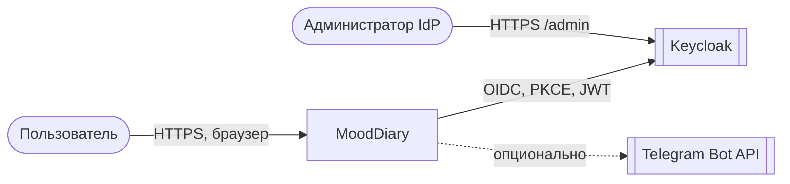
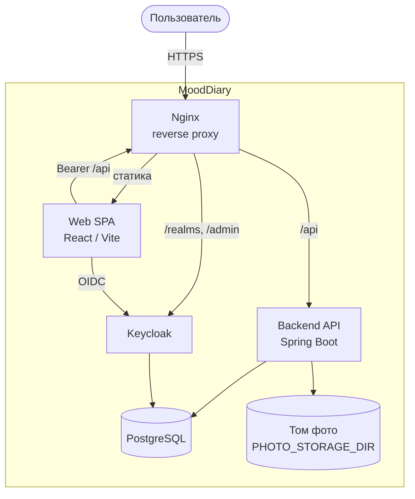
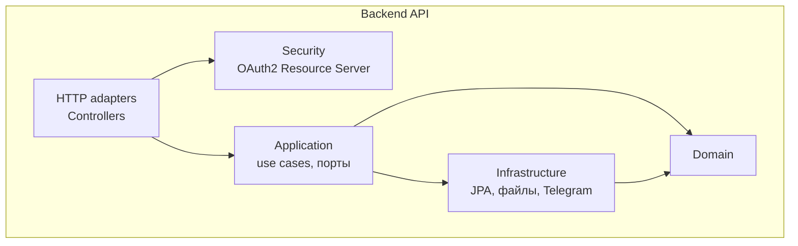
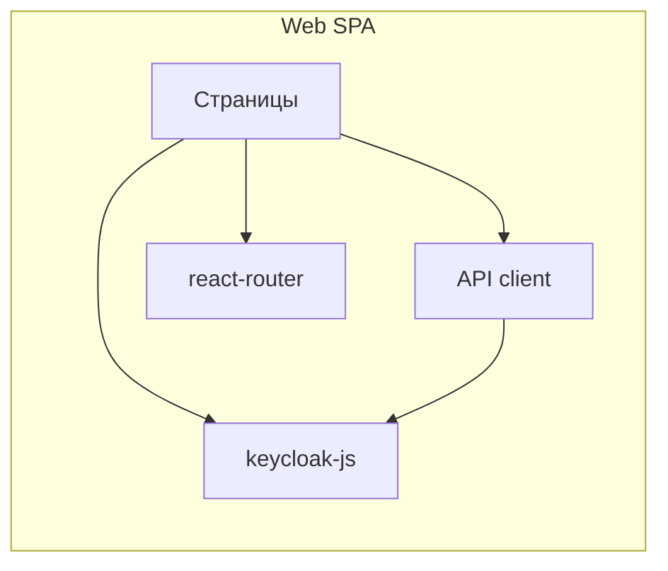

# MoodDiary — модель C4

Архитектурные представления по [C4 model](https://c4model.com/): **Context** → **Container** → **Component**. Уровень **Code** — см. `README.md` и пакеты `com.mooddiary.diary`.

## Как вставлять диаграммы в Mermaid Live / редактор

**Ошибка `Unexpected token '#'` / «не валидный JSON»** возникает, если в поле кода вставлен **весь этот `.md` файл** (он начинается с `#`) или в поле **JSON** вставлен текст не в формате JSON.

Что делать:

1. Копируйте **только** содержимое блока ` ```mermaid ... ``` ` — без строк с тремя обратными кавычками.
2. Либо откройте готовый файл **без** `#` в начале: [`docs/diagrams/c4-01-context.mmd`](./diagrams/c4-01-context.mmd) и следующие по номеру.
3. В [Mermaid Live Editor](https://mermaid.live) вставляйте код в левую панель как **текст Mermaid**, не как JSON.

Ниже — **универсальные `flowchart`** (работают в любом рендерере Mermaid). Расширенный синтаксис **C4** (строки `C4Context`, `C4Container`…) есть только в файлах `docs/diagrams/*.mmd` и требует поддержки C4 в Mermaid.

---

## Уровень 1 — System Context



**Назначение:** граница продукта и внешние системы (IdP, опционально Telegram).

---

## Уровень 2 — Containers (production)



**Локально:** SPA часто на порту 5173, backend на 8080, Keycloak на 8180 — логика та же, edge может быть без Nginx.

---

## Уровень 3 — Components (Backend API)



| Блок | Пакеты |
|------|--------|
| HTTP adapters | `adapter.http.*Controller` |
| Security | `adapter.security.SecurityConfiguration` |
| Application | `application.*`, `application.port.out` |
| Domain | `domain.*` |
| Infrastructure | `infrastructure.persistence.impl`, `infrastructure.storage` |

---

## Уровень 3 — Components (Web SPA)



---

## Уровень 4 — Code (указатель)

- `domain` — доменная модель  
- `application` — сценарии и порты  
- `adapter` — вход HTTP и интеграции  
- `infrastructure` — БД и файлы  

---

## Файлы с диалектом C4 (Mermaid C4)

| Файл | Содержание |
|------|------------|
| [diagrams/c4-01-context.mmd](./diagrams/c4-01-context.mmd) | Контекст |
| [diagrams/c4-02-container.mmd](./diagrams/c4-02-container.mmd) | Контейнеры |
| [diagrams/c4-03-component-api.mmd](./diagrams/c4-03-component-api.mmd) | Компоненты API |
| [diagrams/c4-04-component-spa.mmd](./diagrams/c4-04-component-spa.mmd) | Компоненты SPA |

Вставляйте **целиком содержимое `.mmd`** в редактор Mermaid с поддержкой C4 (часто нужен Mermaid ≥ 10 и включённый тип **C4**).

---

## Связанные документы

- [TOGAF-MoodDiary.md](./TOGAF-MoodDiary.md)  
- [README.md](../README.md)  

**Инструменты:** [Structurizr](https://structurizr.com/), [PlantUML C4](https://github.com/plantuml-stdlib/C4-PlantUML).
