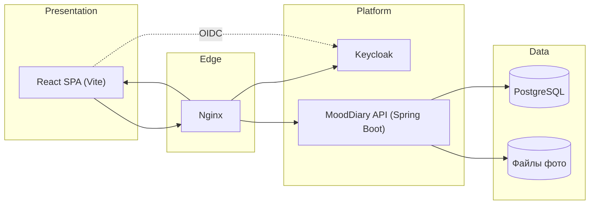

# MoodDiary — архитектурное описание (TOGAF ADM)

Документ следует структуре **TOGAF ADM** (Architecture Development Method) в сжатом виде: видение, бизнес-контекст, приложения, данные, технологии, безопасность, развёртывание. Источник фактов — код и конфигурация репозитория.

---

## 1. Предварительная фаза и принципы

| Принцип | Реализация |
|--------|------------|
| Разделение слоёв | Гексагональная архитектура: `domain` → `application` (порты) → `infrastructure` / `adapter` |
| Единый источник правды по схеме БД | Liquibase, `hibernate.ddl-auto: validate` |
| Безопасность по умолчанию | OAuth2 Resource Server (JWT), идентификация через Keycloak |
| Наблюдаемость | Actuator: health, metrics, prometheus |
| Аудит действий | Запись в `audit_log` с метаданными запроса |

---

## 2. Архитектурное видение (Phase A — Architecture Vision)

**Цель продукта:** веб-приложение «дневник настроения» — пользователь фиксирует ежедневные показатели (настроение, энергия, продуктивность, стресс, сон), заметки, теги, симптомы, фото; просматривает историю и аналитику.

**Ключевые заинтересованные стороны:** конечный пользователь (владелец данных), оператор инфраструктуры (VPS/Docker).

**Ограничения:** PostgreSQL как СУБД; браузерный клиент (SPA); внешний IdP (Keycloak) для аутентификации.

---

## 3. Бизнес-архитектура (Phase B — Business Architecture)

### 3.1 Возможности (Business Capabilities)

| Возможность | Описание |
|-------------|----------|
| Управление идентичностью | Вход через OIDC (Keycloak), привязка `keycloak_subject` к внутреннему `user_id` |
| Ведение дневника | CRUD записей дня, теги, симптомы |
| Медиа | Загрузка/удаление фото к записям, локальное хранилище файлов |
| Аналитика | Агрегаты по периоду, корреляции, ряды по датам |
| Настройки | Тема UI, опционально Telegram Chat ID для саммари |
| Соответствие и след | Аудит значимых действий |

### 3.2 Акторы

- **Пользователь приложения** — единственный бизнес-актор; данные изолированы по `user_id`.
- **Администратор Keycloak** — управление realm, пользователями IdP (вне домена приложения).

---

## 4. Информационная система — прикладная архитектура (Phase C — Application Architecture)

### 4.1 Логические приложения

### 4.2 Структура backend (гексагон)

| Слой | Назначение | Примеры |
|------|------------|---------|
| **Domain** | Сущности, инварианты, value objects | `DiaryEntry`, `Score1to10`, `Tag`, … |
| **Application** | Use cases, порты выхода | `CreateDiaryEntryUseCase`, `*RepositoryPort` |
| **Adapter (вход)** | HTTP, security | `*Controller`, `SecurityConfiguration` |
| **Infrastructure (выход)** | JPA, файлы, внешние клиенты | `*JpaAdapter`, `LocalFileStoragePort`, Telegram |

### 4.3 Основные API-границы (REST)

- `/api/v1/diary-entries` — записи дневника  
- Теги, симптомы, фото, аналитика, настройки (`/api/v1/...`)  
- Actuator: отдельный порт управления (`management.server.port`)

Публичные пути (без JWT): health/info/prometheus, часть `/api/v1/auth/**` (если используется).

---

## 5. Информационная система — архитектура данных (Phase C — Data Architecture)

### 5.1 Хранилища

| Хранилище | Назначение |
|-----------|------------|
| **PostgreSQL** | Пользователи (маппинг Keycloak), записи дневника, теги, симптомы, фото (метаданные), аудит, схема Keycloak (отдельная БД/схема в prod compose) |
| **Файловая система** | Бинарное содержимое фотографий (`PHOTO_STORAGE_DIR`) |

### 5.2 Эволюция схемы

- Миграции: Liquibase (`src/main/resources/db/changelog/`).
- Мастер-файл: `db.changelog-master.yaml`.

### 5.3 Идентификаторы и границы данных

- Суррогатные ключи UUID.  
- Изоляция данных по пользователю на уровне запросов use case / репозиториев.

---

## 6. Технологическая архитектура (Phase D — Technology Architecture)

### 6.1 Стек

| Слой | Технология |
|------|------------|
| Runtime backend | Java 17, Spring Boot 3.2.x |
| API | Spring Web, Validation, Security (OAuth2 Resource Server) |
| Persistence | Spring Data JPA, Hibernate, PostgreSQL driver |
| Миграции | Liquibase |
| Frontend | React, TypeScript, Vite, Tailwind, keycloak-js (PKCE) |
| Контейнеризация | Docker, Docker Compose |
| Reverse proxy | Nginx (статика SPA, `/api` → backend, `/admin` `/realms` → Keycloak) |
| IdP | Keycloak (OIDC) |

### 6.2 Сетевая модель (production, упрощённо)

- Клиент → `:80` / `:443` → Nginx.  
- Внутренняя сеть Docker: `backend:8080`, `keycloak:8080`, `postgres:5432`.  
- Keycloak и backend используют переменные `DOMAIN`, `PROTOCOL` для issuer/JWKS URI.

### 6.3 Нефункциональные требования (следствие из кода)

- Stateless API (JWT, без серверных сессий).  
- Лимиты загрузки файлов через `spring.servlet.multipart` и настройки `mooddiary.upload.photo`.

---

## 7. Безопасность и соответствие

| Аспект | Реализация |
|--------|------------|
| Аутентификация | Keycloak (Authorization Code + PKCE в SPA) |
| Авторизация API | JWT Bearer, валидация по JWKS (`KEYCLOAK_JWKS_URI`, issuer) |
| Аудит | События с пользователем, сущностью, IP, заголовками прокси |
| Секреты | Env-переменные в compose (пароли БД, админ Keycloak), не коммитить в git |

---

## 8. Реализация и миграция (Phase E — Opportunities & Solutions / Phase F — Migration Planning)

- **Локально:** `docker compose` (см. `README.md`), frontend `npm run dev` с proxy на API.  
- **Production VPS:** каталог `deploy/`: `docker-compose.prod.yml`, `deploy.sh`, `nginx.conf`, шаблон realm Keycloak, документация `DEPLOY-IP.md`, `TROUBLESHOOT.md`.  
- **Известный риск эксплуатации:** устаревший `docker-compose` v1 (Python) может давать `KeyError: 'ContainerConfig'` на новых Docker API — рекомендуется **Docker Compose v2** (`docker compose`).

---

## 9. Управление архитектурой (Phase G — Implementation Governance)

- Изменения схемы БД только через Liquibase.  
- Изменения портов приложения — через интерфейсы в `application.port`.  
- Деплой: пересборка образов backend/nginx при изменении кода; обновление Keycloak при изменении realm-шаблона.

---

## 10. Соответствие фазам TOGAF ADM (краткая матрица)

| Фаза ADM | Содержание в проекте |
|----------|----------------------|
| Preliminary | Принципы в README, слои hexagonal |
| A — Vision | Цель продукта, границы системы |
| B — Business | Возможности, акторы |
| C — IS Architecture | Приложения (SPA, API, Keycloak), данные (PostgreSQL, файлы) |
| D — Technology | Стек, Docker, Nginx |
| E–F | Деплой, миграция на VPS |
| G | Правила изменений (Liquibase, порты) |

---

## 11. Дальнейшее развитие (архитектурный бэклог)

- Включение HTTPS (Let's Encrypt) и жёсткая политика `sslRequired` в Keycloak для production.  
- Вывод `docker compose` v2 в обязательные требования к хосту.  
- При росте нагрузки — вынос файлов в object storage (S3-совместимый), read replicas БД (по необходимости).

---

*Документ отражает состояние кодовой базы на момент составления. Для официальной сертификации TOGAF требуется расширение артефактов (матрицы заинтересованных сторон, детальные контракты сервисов, целевая архитектура по доменам предприятия).*

**Ссылки:** [TOGAF Standard](https://www.opengroup.org/togaf) — методология The Open Group.
